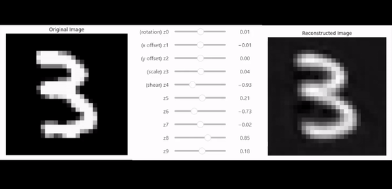
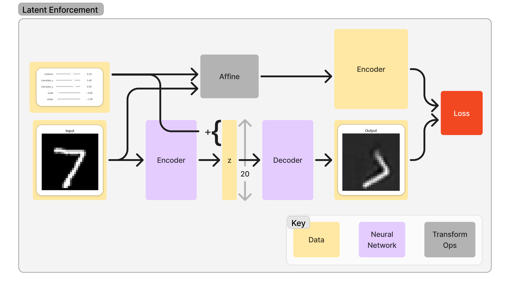

# Enforced Autoencoder: Learning Interpretable Latent Variables

This repository implements a novel learning algorithm for autoencoders that discovers interpretable and controllable latent variables without explicit supervision. The algorithm enforces specific transformations during training, allowing the model to learn meaningful representations.



## Overview

The enforced autoencoder (EnforcedAE) learns to map input data to a latent space where specific dimensions correspond to interpretable transformations (like rotation, translation, scale, etc.). This is achieved through a specialized training procedure:



During training, the model:
1. Takes an input image
2. Applies random transformations
3. Learns to encode the original image and predict the transformed version by modifying specific latent dimensions


## Implementation

The core implementation can be found in the EnforcedAE class:
```python:nn/enforced_ae.py
startLine: 8
endLine: 97
```

Key features:
- Supports both CNN and MLP architectures
- Learns 5 interpretable dimensions (rotation, x-translation, y-translation, scale, shear)
- Remaining latent dimensions capture other image features

## Usage

```python
# Initialize model
model = EnforcedAE(in_channels=1, z_dim=20, cnn=True)

# Train
train_model(model, train_dataset, val_dataset)

# Manipulate latent variables
images = next(iter(test_loader))
play_with_latents(model, images, labelled=True)
```

## Requirements

- PyTorch
- torchvision
- matplotlib
- tqdm
- ipywidgets (for interactive demos)